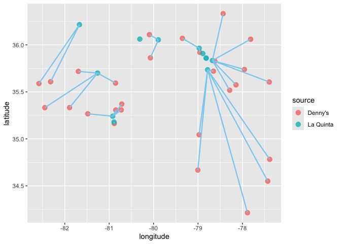

Lab 05 - Wrangling spatial data
================
Allison Li
02/09/2025

``` r
##devtools::install_github("rstudio-education/dsbox")
library(tidyverse)
library(dsbox)
```

### Exercise 1

``` r
dn_ak <- dennys %>%
  filter(state == "AK")
nrow(dn_ak)
```

    ## [1] 3

``` r
lq_ak <- laquinta %>%
  filter(state == "AK")
nrow(dn_ak)
```

    ## [1] 3

There are 3 Denny’s stores in Alaska and 2 La Quinta hotels in Alaska.

### Exercise 2

``` r
pairings_of_lqak <- nrow(dn_ak) * nrow(lq_ak)
cat("The number of pairings between the locations of Denny’s and La Quinta hotels in Alaska are:", pairings_of_lqak, "\n")
```

    ## The number of pairings between the locations of Denny’s and La Quinta hotels in Alaska are: 6

I asked ChatGPT to help me generate this code because I was not sure
what could be the correct function for this.

### Exercise 3

``` r
dn_lq_ak <- full_join(dn_ak, lq_ak, 
                      by = "state")
```

    ## Warning in full_join(dn_ak, lq_ak, by = "state"): Detected an unexpected many-to-many relationship between `x` and `y`.
    ## ℹ Row 1 of `x` matches multiple rows in `y`.
    ## ℹ Row 1 of `y` matches multiple rows in `x`.
    ## ℹ If a many-to-many relationship is expected, set `relationship =
    ##   "many-to-many"` to silence this warning.

``` r
dn_lq_ak
```

    ## # A tibble: 6 × 11
    ##   address.x     city.x state zip.x longitude.x latitude.x address.y city.y zip.y
    ##   <chr>         <chr>  <chr> <chr>       <dbl>      <dbl> <chr>     <chr>  <chr>
    ## 1 2900 Denali   Ancho… AK    99503       -150.       61.2 3501 Min… "\nAn… 99503
    ## 2 2900 Denali   Ancho… AK    99503       -150.       61.2 4920 Dal… "\nFa… 99709
    ## 3 3850 Debarr … Ancho… AK    99508       -150.       61.2 3501 Min… "\nAn… 99503
    ## 4 3850 Debarr … Ancho… AK    99508       -150.       61.2 4920 Dal… "\nFa… 99709
    ## 5 1929 Airport… Fairb… AK    99701       -148.       64.8 3501 Min… "\nAn… 99503
    ## 6 1929 Airport… Fairb… AK    99701       -148.       64.8 4920 Dal… "\nFa… 99709
    ## # ℹ 2 more variables: longitude.y <dbl>, latitude.y <dbl>

### Exercise 4

There are 11 observations in the joined data frame. The names including
city.x, zip.x, longitude.x, latitude.x, address.x, which all refer to
the locations of the Denny’s. The names of the rest variables, including
city.y, zip.y, longitude.y, latitude.y, address.y all refer to the
locations of the La Quinta hotels.

### Exercise 5

``` r
haversine <- function(long1, lat1, long2, lat2, round = 3) {
  # convert to radians
  long1 <- long1 * pi / 180
  lat1 <- lat1 * pi / 180
  long2 <- long2 * pi / 180
  lat2 <- lat2 * pi / 180

  R <- 6371 # Earth mean radius in km

  a <- sin((lat2 - lat1) / 2)^2 + cos(lat1) * cos(lat2) * sin((long2 - long1) / 2)^2
  d <- R * 2 * asin(sqrt(a))

  return(round(d, round)) # distance in km
}
```

To answer the question of what function to use from the tidyverse to add
a new variable while keeping the existing ones, I believe we can use
mutate().

### Exercise 6

``` r
dn_lq_ak <- dn_lq_ak %>%
  mutate(distance = haversine(longitude.x, latitude.x, longitude.y, latitude.y))

print(dn_lq_ak)
```

    ## # A tibble: 6 × 12
    ##   address.x     city.x state zip.x longitude.x latitude.x address.y city.y zip.y
    ##   <chr>         <chr>  <chr> <chr>       <dbl>      <dbl> <chr>     <chr>  <chr>
    ## 1 2900 Denali   Ancho… AK    99503       -150.       61.2 3501 Min… "\nAn… 99503
    ## 2 2900 Denali   Ancho… AK    99503       -150.       61.2 4920 Dal… "\nFa… 99709
    ## 3 3850 Debarr … Ancho… AK    99508       -150.       61.2 3501 Min… "\nAn… 99503
    ## 4 3850 Debarr … Ancho… AK    99508       -150.       61.2 4920 Dal… "\nFa… 99709
    ## 5 1929 Airport… Fairb… AK    99701       -148.       64.8 3501 Min… "\nAn… 99503
    ## 6 1929 Airport… Fairb… AK    99701       -148.       64.8 4920 Dal… "\nFa… 99709
    ## # ℹ 3 more variables: longitude.y <dbl>, latitude.y <dbl>, distance <dbl>

### Exercise 7

``` r
## I changed summarize to mutate here because I want closest distance to be a new variable in the dataset while keeping other varaibles as well.
dn_lq_ak_mindist <- dn_lq_ak %>%
  group_by(address.x) %>%
  mutate(closest = min(distance))

print(dn_lq_ak_mindist)
```

    ## # A tibble: 6 × 13
    ## # Groups:   address.x [3]
    ##   address.x     city.x state zip.x longitude.x latitude.x address.y city.y zip.y
    ##   <chr>         <chr>  <chr> <chr>       <dbl>      <dbl> <chr>     <chr>  <chr>
    ## 1 2900 Denali   Ancho… AK    99503       -150.       61.2 3501 Min… "\nAn… 99503
    ## 2 2900 Denali   Ancho… AK    99503       -150.       61.2 4920 Dal… "\nFa… 99709
    ## 3 3850 Debarr … Ancho… AK    99508       -150.       61.2 3501 Min… "\nAn… 99503
    ## 4 3850 Debarr … Ancho… AK    99508       -150.       61.2 4920 Dal… "\nFa… 99709
    ## 5 1929 Airport… Fairb… AK    99701       -148.       64.8 3501 Min… "\nAn… 99503
    ## 6 1929 Airport… Fairb… AK    99701       -148.       64.8 4920 Dal… "\nFa… 99709
    ## # ℹ 4 more variables: longitude.y <dbl>, latitude.y <dbl>, distance <dbl>,
    ## #   closest <dbl>

### Exercise 8

``` r
## Mean 
mean_closestdist <- mean(dn_lq_ak_mindist$closest) 
## Standard deviation 
sd_closestdist <- sd(dn_lq_ak_mindist$closest) 

## I want to merge the two dataset so that I can have a set including five stores and their location information, as well as which ones are La Quinta and which ones are Denny's.
dn_ak <- dn_ak %>% mutate(source = "Denny's")
lq_ak <- lq_ak %>% mutate(source = "La Quinta")
merged_data_ak <- bind_rows(dn_ak, lq_ak)

## The section block below is helped by ChatGPT. I asked it how to generate a dataset with only the three minimum distances and their longitude, latitude, and other variables of Denny's and La Quinta hotels accordingly.
dn_lq_ak_minidis <- dn_lq_ak %>%
  group_by(address.x) %>%
  filter(distance == min(distance)) %>% 
  ungroup()

## I want the visualized plot to be able to show the shortest distances between each Denny's and La Quinta hotel. 
ggplot(merged_data_ak, aes(x = longitude, y = latitude, color = source)) +
  geom_point(size = 3, alpha = 0.8) + 
  geom_segment(data = dn_lq_ak_minidis,
               aes(x = longitude.x, y = latitude.x, 
                   xend = longitude.y, yend = latitude.y), 
               color ="purple", linetype = "solid", size = .8)
```

    ## Warning: Using `size` aesthetic for lines was deprecated in ggplot2 3.4.0.
    ## ℹ Please use `linewidth` instead.
    ## This warning is displayed once every 8 hours.
    ## Call `lifecycle::last_lifecycle_warnings()` to see where this warning was
    ## generated.

<!-- -->

``` r
  labs(title = "Scatter Plot of Denny's and La Quinta",
       x = "Longitude",
       y = "Latitude",
       color = "Dataset")
```

    ## $x
    ## [1] "Longitude"
    ## 
    ## $y
    ## [1] "Latitude"
    ## 
    ## $colour
    ## [1] "Dataset"
    ## 
    ## $title
    ## [1] "Scatter Plot of Denny's and La Quinta"
    ## 
    ## attr(,"class")
    ## [1] "labels"

The three minimum distance between the Denny’s and La Quinta hotels are
2.04, 2.04, and 5.2 separately. The mean for the minimum distances is
4.41 while the standard deviation is 1.87.

In terms of visiualization, with the help of Chatgpt, I am able to add
the purple lines that demostrate the minimum distances between Denny’s
and La Quinta hotels, yay!

### Exercise 9.1

``` r
dn_nc <- dennys %>%
  filter(state == "NC")
nrow(dn_nc)
```

    ## [1] 28

``` r
lq_nc <- laquinta %>%
  filter(state == "NC")
nrow(dn_nc)
```

    ## [1] 28

### Exercise 9.2

``` r
pairings_of_lqnc <- nrow(dn_nc) * nrow(lq_nc)
cat("The number of pairings between the locations of Denny’s and La Quinta hotels in North Carolina are:", pairings_of_lqnc, "\n")
```

    ## The number of pairings between the locations of Denny’s and La Quinta hotels in North Carolina are: 336

### Exercise 9.3

``` r
dn_lq_nc <- full_join(dn_nc, lq_nc, 
                      by = "state")
```

    ## Warning in full_join(dn_nc, lq_nc, by = "state"): Detected an unexpected many-to-many relationship between `x` and `y`.
    ## ℹ Row 1 of `x` matches multiple rows in `y`.
    ## ℹ Row 1 of `y` matches multiple rows in `x`.
    ## ℹ If a many-to-many relationship is expected, set `relationship =
    ##   "many-to-many"` to silence this warning.

``` r
dn_lq_nc
```

    ## # A tibble: 336 × 11
    ##    address.x    city.x state zip.x longitude.x latitude.x address.y city.y zip.y
    ##    <chr>        <chr>  <chr> <chr>       <dbl>      <dbl> <chr>     <chr>  <chr>
    ##  1 1 Regent Pa… Ashev… NC    28806       -82.6       35.6 165 Hwy … "\nBo… 28607
    ##  2 1 Regent Pa… Ashev… NC    28806       -82.6       35.6 3127 Slo… "\nCh… 28208
    ##  3 1 Regent Pa… Ashev… NC    28806       -82.6       35.6 4900 Sou… "\nCh… 28217
    ##  4 1 Regent Pa… Ashev… NC    28806       -82.6       35.6 4414 Dur… "\nDu… 27707
    ##  5 1 Regent Pa… Ashev… NC    28806       -82.6       35.6 1910 Wes… "\nDu… 27713
    ##  6 1 Regent Pa… Ashev… NC    28806       -82.6       35.6 1201 Lan… "\nGr… 27407
    ##  7 1 Regent Pa… Ashev… NC    28806       -82.6       35.6 1607 Fai… "\nCo… 28613
    ##  8 1 Regent Pa… Ashev… NC    28806       -82.6       35.6 191 Cres… "\nCa… 27518
    ##  9 1 Regent Pa… Ashev… NC    28806       -82.6       35.6 2211 Sum… "\nRa… 27612
    ## 10 1 Regent Pa… Ashev… NC    28806       -82.6       35.6 1001 Aer… "\nMo… 27560
    ## # ℹ 326 more rows
    ## # ℹ 2 more variables: longitude.y <dbl>, latitude.y <dbl>

``` r
dn_lq_nc <- dn_lq_nc %>%
  mutate(distance = haversine(longitude.x, latitude.x, longitude.y, latitude.y))

print(dn_lq_nc)
```

    ## # A tibble: 336 × 12
    ##    address.x    city.x state zip.x longitude.x latitude.x address.y city.y zip.y
    ##    <chr>        <chr>  <chr> <chr>       <dbl>      <dbl> <chr>     <chr>  <chr>
    ##  1 1 Regent Pa… Ashev… NC    28806       -82.6       35.6 165 Hwy … "\nBo… 28607
    ##  2 1 Regent Pa… Ashev… NC    28806       -82.6       35.6 3127 Slo… "\nCh… 28208
    ##  3 1 Regent Pa… Ashev… NC    28806       -82.6       35.6 4900 Sou… "\nCh… 28217
    ##  4 1 Regent Pa… Ashev… NC    28806       -82.6       35.6 4414 Dur… "\nDu… 27707
    ##  5 1 Regent Pa… Ashev… NC    28806       -82.6       35.6 1910 Wes… "\nDu… 27713
    ##  6 1 Regent Pa… Ashev… NC    28806       -82.6       35.6 1201 Lan… "\nGr… 27407
    ##  7 1 Regent Pa… Ashev… NC    28806       -82.6       35.6 1607 Fai… "\nCo… 28613
    ##  8 1 Regent Pa… Ashev… NC    28806       -82.6       35.6 191 Cres… "\nCa… 27518
    ##  9 1 Regent Pa… Ashev… NC    28806       -82.6       35.6 2211 Sum… "\nRa… 27612
    ## 10 1 Regent Pa… Ashev… NC    28806       -82.6       35.6 1001 Aer… "\nMo… 27560
    ## # ℹ 326 more rows
    ## # ℹ 3 more variables: longitude.y <dbl>, latitude.y <dbl>, distance <dbl>

### Exercise 9.4

``` r
dn_lq_nc_minidis <- dn_lq_nc %>%
  group_by(address.x) %>%
  summarize(closest = min(distance))

print(dn_lq_nc_minidis)
```

    ## # A tibble: 28 × 2
    ##    address.x                 closest
    ##    <chr>                       <dbl>
    ##  1 1 Regent Park Boulevard     108. 
    ##  2 101 Wintergreen Dr          120. 
    ##  3 103 Sedgehill Dr             26.7
    ##  4 1043 Jimmie Kerr Road        36.1
    ##  5 1201 S College Road         188. 
    ##  6 1209 Burkemount Avenue       39.1
    ##  7 1493 Us Hwy 74-A Bypass      70.1
    ##  8 1524 Dabney Dr               59.5
    ##  9 1550 Four Seasons           115. 
    ## 10 1800 Princeton-Kenly Road    55.9
    ## # ℹ 18 more rows

### Exercise 9.5

``` r
## Mean 
mean_closestdist_nc <- mean(dn_lq_nc_minidis$closest) 
## Standard deviation 
sd_closestdist_nc <- sd(dn_lq_nc_minidis$closest) 

dn_nc <- dn_nc %>% mutate(source = "Denny's")
lq_nc <- lq_nc %>% mutate(source = "La Quinta")
merged_data_nc <- bind_rows(dn_nc, lq_nc)

## filter the closest distances
dn_lq_nc_minidis <- dn_lq_nc %>%
  group_by(address.x) %>%
  filter(distance == min(distance)) %>% 
  ungroup()

## A scattor plot as the visualization to show the shortest distances between each Denny's and La Quinta hotel. 
ggplot(merged_data_nc, aes(x = longitude, y = latitude, color = source)) +
  geom_point(size = 3, alpha = 0.8) + 
  geom_segment(data = dn_lq_nc_minidis,
               aes(x = longitude.x, y = latitude.x, 
                   xend = longitude.y, yend = latitude.y), 
               color ="#89CFF0", linetype = "solid", size = .8)
```

<!-- -->

There are 28 minimum distances between each Denny’s and a La Quinta
hotel. The mean for the minimum distances is 65.44 while the standard
deviation is 53.42.

### Exercise 10.1

``` r
dn_tx <- dennys %>%
  filter(state == "TX")
nrow(dn_tx)
```

    ## [1] 200

``` r
lq_tx <- laquinta %>%
  filter(state == "TX")
nrow(dn_tx)
```

    ## [1] 200

### Exercise 10.2

``` r
pairings_tx <- nrow(dn_tx) * nrow(lq_tx)
cat("The number of pairings between the locations of Denny’s and La Quinta hotels in Texas are:", pairings_tx, "\n")
```

    ## The number of pairings between the locations of Denny’s and La Quinta hotels in Texas are: 47400

### Exercise 10.3

``` r
dn_lq_tx <- full_join(dn_tx, lq_tx, 
                      by = "state")
```

    ## Warning in full_join(dn_tx, lq_tx, by = "state"): Detected an unexpected many-to-many relationship between `x` and `y`.
    ## ℹ Row 1 of `x` matches multiple rows in `y`.
    ## ℹ Row 1 of `y` matches multiple rows in `x`.
    ## ℹ If a many-to-many relationship is expected, set `relationship =
    ##   "many-to-many"` to silence this warning.

``` r
dn_lq_tx
```

    ## # A tibble: 47,400 × 11
    ##    address.x    city.x state zip.x longitude.x latitude.x address.y city.y zip.y
    ##    <chr>        <chr>  <chr> <chr>       <dbl>      <dbl> <chr>     <chr>  <chr>
    ##  1 120 East I-… Abile… TX    79601       -99.6       32.4 3018 Cat… "\nAb… 79606
    ##  2 120 East I-… Abile… TX    79601       -99.6       32.4 3501 Wes… "\nAb… 79601
    ##  3 120 East I-… Abile… TX    79601       -99.6       32.4 14925 La… "\nAd… 75254
    ##  4 120 East I-… Abile… TX    79601       -99.6       32.4 909 East… "\nAl… 78516
    ##  5 120 East I-… Abile… TX    79601       -99.6       32.4 2400 Eas… "\nAl… 78332
    ##  6 120 East I-… Abile… TX    79601       -99.6       32.4 1220 Nor… "\nAl… 75013
    ##  7 120 East I-… Abile… TX    79601       -99.6       32.4 1165 Hwy… "\nAl… 76009
    ##  8 120 East I-… Abile… TX    79601       -99.6       32.4 880 Sout… "\nAl… 77511
    ##  9 120 East I-… Abile… TX    79601       -99.6       32.4 1708 Int… "\nAm… 79103
    ## 10 120 East I-… Abile… TX    79601       -99.6       32.4 9305 Eas… "\nAm… 79118
    ## # ℹ 47,390 more rows
    ## # ℹ 2 more variables: longitude.y <dbl>, latitude.y <dbl>

``` r
dn_lq_tx <- dn_lq_tx %>%
  mutate(distance = haversine(longitude.x, latitude.x, longitude.y, latitude.y))

print(dn_lq_tx)
```

    ## # A tibble: 47,400 × 12
    ##    address.x    city.x state zip.x longitude.x latitude.x address.y city.y zip.y
    ##    <chr>        <chr>  <chr> <chr>       <dbl>      <dbl> <chr>     <chr>  <chr>
    ##  1 120 East I-… Abile… TX    79601       -99.6       32.4 3018 Cat… "\nAb… 79606
    ##  2 120 East I-… Abile… TX    79601       -99.6       32.4 3501 Wes… "\nAb… 79601
    ##  3 120 East I-… Abile… TX    79601       -99.6       32.4 14925 La… "\nAd… 75254
    ##  4 120 East I-… Abile… TX    79601       -99.6       32.4 909 East… "\nAl… 78516
    ##  5 120 East I-… Abile… TX    79601       -99.6       32.4 2400 Eas… "\nAl… 78332
    ##  6 120 East I-… Abile… TX    79601       -99.6       32.4 1220 Nor… "\nAl… 75013
    ##  7 120 East I-… Abile… TX    79601       -99.6       32.4 1165 Hwy… "\nAl… 76009
    ##  8 120 East I-… Abile… TX    79601       -99.6       32.4 880 Sout… "\nAl… 77511
    ##  9 120 East I-… Abile… TX    79601       -99.6       32.4 1708 Int… "\nAm… 79103
    ## 10 120 East I-… Abile… TX    79601       -99.6       32.4 9305 Eas… "\nAm… 79118
    ## # ℹ 47,390 more rows
    ## # ℹ 3 more variables: longitude.y <dbl>, latitude.y <dbl>, distance <dbl>

### Exercise 10.4

``` r
dn_lq_tx_minidis <- dn_lq_tx %>%
  group_by(address.x) %>%
  summarize(closest = min(distance))

print(dn_lq_tx_minidis)
```

    ## # A tibble: 200 × 2
    ##    address.x             closest
    ##    <chr>                   <dbl>
    ##  1 100 Cottonwood         33.6  
    ##  2 100 E Pinehurst         1.39 
    ##  3 100 Us Highway 79 S    33.9  
    ##  4 101 N Fm 707           10.3  
    ##  5 1011 Beltway Parkway   14.0  
    ##  6 1015 Spur 350 West      1.74 
    ##  7 1015 West Main St       1.10 
    ##  8 10367 Highway 59       37.6  
    ##  9 10433 N Central Expwy   0.618
    ## 10 105 W 42nd St           6.88 
    ## # ℹ 190 more rows

### Exercise 10.5

``` r
## Mean 
mean_closestdist_tx <- mean(dn_lq_tx_minidis$closest) 
## Standard deviation 
sd_closestdist_tx <- sd(dn_lq_tx_minidis$closest) 

dn_tx <- dn_tx %>% mutate(source = "Denny's")
lq_tx <- lq_tx %>% mutate(source = "La Quinta")
merged_data_tx <- bind_rows(dn_tx, lq_tx)

## filter the closest distances
dn_lq_tx_minidis <- dn_lq_tx %>%
  group_by(address.x) %>%
  filter(distance == min(distance)) %>% 
  ungroup()

## A scattor plot as the visualization to show the shortest distances between each Denny's and La Quinta hotel. 
ggplot(merged_data_tx, aes(x = longitude, y = latitude, color = source)) +
  geom_point(size = 3, alpha = 0.8) + 
  geom_segment(data = dn_lq_tx_minidis,
               aes(x = longitude.x, y = latitude.x, 
                   xend = longitude.y, yend = latitude.y), 
               color = "blue", linetype = "solid", size = .8)
```

<!-- -->

There are 200 minimum distances between each Denny’s and a La Quinta
hotel. The mean for the minimum distances is 5.79 while the standard
deviation is 8.83. Additionally, according to the visualized plot, in
Texas there are a lot of La Quinta hotels that each Denny’s has a La
Quinta hotel near by.

### Exercise 11.1– Ohio

My undergraduate studies was in Ohio so I would like to know how La
Quinta and Denny’s are located in Ohio.

``` r
dn_oh <- dennys %>%
  filter(state == "OH")
nrow(dn_oh)
```

    ## [1] 44

``` r
lq_oh <- laquinta %>%
  filter(state == "OH")
nrow(dn_oh)
```

    ## [1] 44

### Exercise 11.2

``` r
pairings_oh <- nrow(dn_oh) * nrow(lq_oh)
cat("The number of pairings between the locations of Denny’s and La Quinta hotels in Ohio are:", pairings_oh, "\n")
```

    ## The number of pairings between the locations of Denny’s and La Quinta hotels in Ohio are: 748

### Exercise 11.3

``` r
dn_lq_oh <- full_join(dn_oh, lq_oh, 
                      by = "state")
```

    ## Warning in full_join(dn_oh, lq_oh, by = "state"): Detected an unexpected many-to-many relationship between `x` and `y`.
    ## ℹ Row 1 of `x` matches multiple rows in `y`.
    ## ℹ Row 1 of `y` matches multiple rows in `x`.
    ## ℹ If a many-to-many relationship is expected, set `relationship =
    ##   "many-to-many"` to silence this warning.

``` r
dn_lq_oh
```

    ## # A tibble: 748 × 11
    ##    address.x    city.x state zip.x longitude.x latitude.x address.y city.y zip.y
    ##    <chr>        <chr>  <chr> <chr>       <dbl>      <dbl> <chr>     <chr>  <chr>
    ##  1 1681 Home A… Akron  OH    44310       -81.5       41.1 5335 Bro… "\nCa… 44709
    ##  2 1681 Home A… Akron  OH    44310       -81.5       41.1 12150 Sp… "\nSp… 45246
    ##  3 1681 Home A… Akron  OH    44310       -81.5       41.1 9918 Esc… "\nMa… 45040
    ##  4 1681 Home A… Akron  OH    44310       -81.5       41.1 11029 Do… "\nCi… 45241
    ##  5 1681 Home A… Akron  OH    44310       -81.5       41.1 4222 Wes… "\nCl… 44135
    ##  6 1681 Home A… Akron  OH    44310       -81.5       41.1 25105 Co… "\nNo… 44070
    ##  7 1681 Home A… Akron  OH    44310       -81.5       41.1 6161 Qua… "\nIn… 44131
    ##  8 1681 Home A… Akron  OH    44310       -81.5       41.1 268 East… "\nMa… 44056
    ##  9 1681 Home A… Akron  OH    44310       -81.5       41.1 2447 Bri… "\nRe… 43068
    ## 10 1681 Home A… Akron  OH    44310       -81.5       41.1 6145 Par… "\nDu… 43017
    ## # ℹ 738 more rows
    ## # ℹ 2 more variables: longitude.y <dbl>, latitude.y <dbl>

``` r
dn_lq_oh <- dn_lq_oh %>%
  mutate(distance = haversine(longitude.x, latitude.x, longitude.y, latitude.y))

print(dn_lq_oh)
```

    ## # A tibble: 748 × 12
    ##    address.x    city.x state zip.x longitude.x latitude.x address.y city.y zip.y
    ##    <chr>        <chr>  <chr> <chr>       <dbl>      <dbl> <chr>     <chr>  <chr>
    ##  1 1681 Home A… Akron  OH    44310       -81.5       41.1 5335 Bro… "\nCa… 44709
    ##  2 1681 Home A… Akron  OH    44310       -81.5       41.1 12150 Sp… "\nSp… 45246
    ##  3 1681 Home A… Akron  OH    44310       -81.5       41.1 9918 Esc… "\nMa… 45040
    ##  4 1681 Home A… Akron  OH    44310       -81.5       41.1 11029 Do… "\nCi… 45241
    ##  5 1681 Home A… Akron  OH    44310       -81.5       41.1 4222 Wes… "\nCl… 44135
    ##  6 1681 Home A… Akron  OH    44310       -81.5       41.1 25105 Co… "\nNo… 44070
    ##  7 1681 Home A… Akron  OH    44310       -81.5       41.1 6161 Qua… "\nIn… 44131
    ##  8 1681 Home A… Akron  OH    44310       -81.5       41.1 268 East… "\nMa… 44056
    ##  9 1681 Home A… Akron  OH    44310       -81.5       41.1 2447 Bri… "\nRe… 43068
    ## 10 1681 Home A… Akron  OH    44310       -81.5       41.1 6145 Par… "\nDu… 43017
    ## # ℹ 738 more rows
    ## # ℹ 3 more variables: longitude.y <dbl>, latitude.y <dbl>, distance <dbl>

### Exercise 11.4

``` r
dn_lq_oh_minidis <- dn_lq_oh %>%
  group_by(address.x) %>%
  summarize(closest = min(distance))

print(dn_lq_oh_minidis)
```

    ## # A tibble: 44 × 2
    ##    address.x                closest
    ##    <chr>                      <dbl>
    ##  1 10 Airport Rd              79.7 
    ##  2 10480 Baltimore            19.7 
    ##  3 1050 Mt Vernon Ave         51.6 
    ##  4 1051 Interstate Court      54.7 
    ##  5 1122 Buck Road              5.44
    ##  6 1136 South Main Street     11.1 
    ##  7 1256 W High Extension      40.8 
    ##  8 154 Boardman-Canfield Rd   65.7 
    ##  9 1681 Home Ave              20.5 
    ## 10 1750 Cedar Street          38.3 
    ## # ℹ 34 more rows

### Exercise 11.5

``` r
## Mean 
mean_closestdist_oh <- mean(dn_lq_oh_minidis$closest) 
## Standard deviation 
sd_closestdist_oh <- sd(dn_lq_oh_minidis$closest) 

dn_oh <- dn_oh %>% mutate(source = "Denny's")
lq_oh <- lq_oh %>% mutate(source = "La Quinta")
merged_data_oh <- bind_rows(dn_oh, lq_oh)

## filter the closest distances
dn_lq_oh_minidis <- dn_lq_oh %>%
  group_by(address.x) %>%
  filter(distance == min(distance)) %>% 
  ungroup()

## A scattor plot as the visualization to show the shortest distances between each Denny's and La Quinta hotel. 
ggplot(merged_data_oh, aes(x = longitude, y = latitude, color = source)) +
  geom_point(size = 3, alpha = 0.8) + 
  geom_segment(data = dn_lq_oh_minidis,
               aes(x = longitude.x, y = latitude.x, 
                   xend = longitude.y, yend = latitude.y), 
               color = "#FFEE8C", linetype = "solid", size = .8)
```

<!-- -->

There are 44 minimum distances between each Denny’s and a La Quinta
hotel. The mean for the minimum distances is 33.38 while the standard
deviation is 29.26. Additionally, according to the visualized plot,
there are alot of Denny’s in Ohio and many of them do not have a La
Quinta hotel near by.

### Exercise 12

Amomg all the states I have examined, I believe Mitch Hedberg’s joke
that each Denny’s has a La Quinta nearby is most likely to hold true in
Texas and Alaska. According to the data, Texas’ mean value for closest
distance between Denny’s and La Quinta is 5.79, while the mean value in
Alaska is 4.41. Based on the scattor plot, we can see that Denny’s in
both Texas and Alaska have at least one really close La Quinta hotel.
